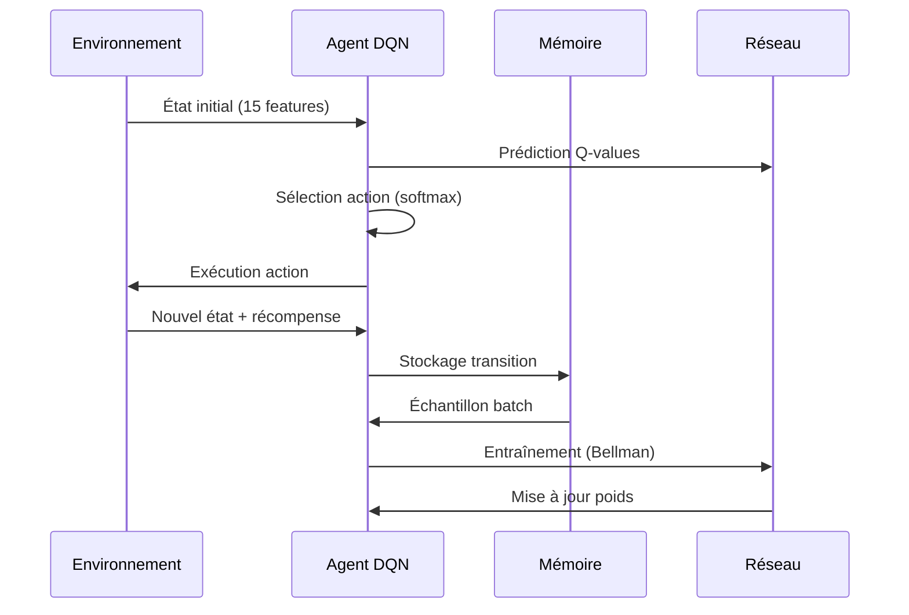
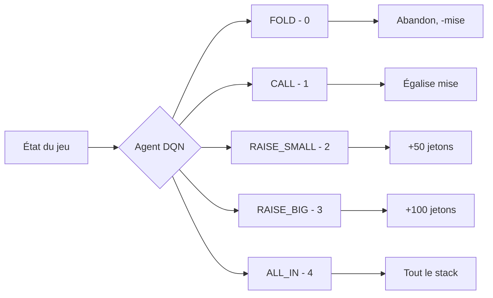
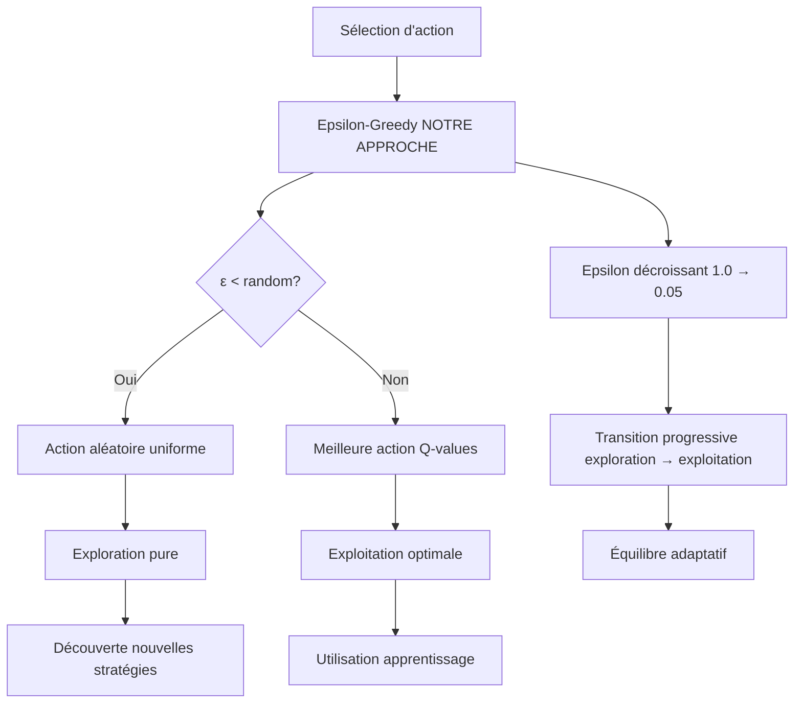
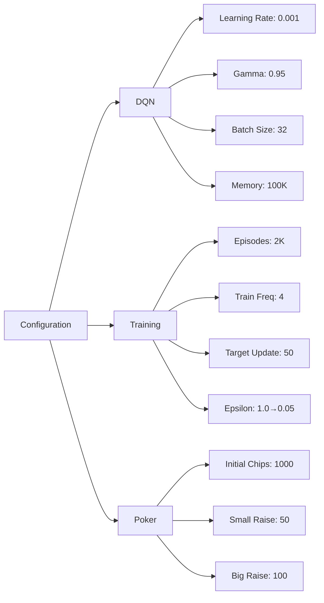

# 🃏 Projet DQN Texas Hold'em No Limit

## Vue d'ensemble

Ce projet implémente un **agent d'intelligence artificielle** utilisant le **Deep Q-Network (DQN)** pour apprendre à jouer au **Texas Hold'em Poker No Limit**. L'agent utilise l'apprentissage par renforcement avec exploration **epsilon-greedy** pour développer une stratégie de poker optimale.

## 🚀 Fonctionnalités

- **Agent DQN** avec réseau de neurones profond (128→128→64→32)
- **Exploration epsilon-greedy** avec décroissance progressive (1.0 → 0.05)
- **Experience Replay** avec buffer de 100K transitions
- **Target Network** pour stabiliser l'entraînement
- **TensorBoard** pour visualiser les métriques d'entraînement
- **Environnement Poker** complet avec évaluation Treys
- **Interface console** stylée avec affichage en temps réel

## 📁 Structure des fichiers

```
DQN_TexasHoldEm_NoLimit/
├── README.MD                    # Documentation principale
├── regles-poker.MD              # Règles du poker Texas Hold'em
├── requirements.txt             # Dépendances Python
└── src/
    ├── main.py                  # Point d'entrée principal
    ├── config.py                # Configuration globale
    ├── poker_game.py            # Environnement de jeu (TreysPokerEnv)
    ├── dqn_agent.py             # Agent d'apprentissage par renforcement
    ├── console_display.py       # Interface console trop stylé
    ├── multi_agent_poker.py     # Jeu multi-agents (pas encore implémenté)
    ├── multi_agent_training.py  # Entraînement multi-agents (pas encore implémenté)
    ├── checkpoints/             # Sauvegarde des modèles
    └── logs/                    # Logs TensorBoard
```

## Composants principaux

### 1. **Environnement de jeu** (poker_game.py)
- **TreysPokerEnv** : Simulation complète du poker Texas Hold'em
- **Évaluation des mains** avec la bibliothèque Treys
- **Stratégie d'adversaire** intégrée (bot avec logique prédéfinie)
- **État vectorisé** (15 dimensions) pour l'IA

### 2. **Agent DQN** (dqn_agent.py)
- **Réseau de neurones** dense pour approximer Q(s,a)
- **Experience Replay** avec buffer circulaire (100K transitions)
- **Target Network** pour la stabilité d'entraînement
- **Exploration epsilon-greedy** avec décroissance progressive
- **TensorBoard logging** avec moyennes mobiles sur 100 épisodes

### 3. **Interface console** (console_display.py)

> ![NOTE]
> Vu qu'il n'y a pas d'environement de poker sur gymnasium, alors nous avons créé notre propre environnement de poker avec la bibliothèque Treys.

- **Affichage stylé** avec couleurs (colorama)
- **Visualisation des cartes** et de l'état du jeu (avec Treys)
- **Statistiques d'entraînement** en temps réel

## Flux d'entraînement



## Actions disponibles



## Innovation : Exploration Softmax

### Comparaison Epsilon-Greedy vs Softmax



### Stratégie Epsilon-Greedy
$$
\text{action} = \begin{cases}
\text{argmax}_a Q(s,a) & \text{si } \text{random} > \epsilon \\
\text{action aléatoire} & \text{sinon}
\end{cases}
$$

Avec décroissance : $\epsilon = \max(\epsilon_{\text{min}}, \epsilon \times \text{decay})$

## Technologies utilisées

- **TensorFlow/Keras** : Réseaux de neurones
- **Treys** : Évaluation des mains de poker
- **NumPy** : Calculs matriciels
- **Colorama** : Interface console colorée
- **TensorBoard** : Monitoring d'entraînement

## Hyperparamètres clés



## 📊 Résultats d'entraînement (TensorBoard)

### Tableau des métriques finales

| Métrique | Valeur Finale | Épisode | Description |
|----------|--------------|---------|-------------|
| **Win Rate (100 derniers)** | 69% | 1979 | Pourcentage de victoires sur 100 épisodes |
| **Reward moyen (100 derniers)** | -14.9 | 1979 | Récompense moyenne sur 100 épisodes |
| **Loss moyenne (100 derniers)** | 12,468 | 1979 | Erreur MSE du réseau sur 100 épisodes |
| **Epsilon final** | 0.31 | 1979 | Taux d'exploration restant |
| **Épisodes par seconde** | ~8.1 | - | Vitesse d'entraînement |
| **Steps moyen par épisode** | 1-3 | - | Longueur moyenne des parties |

### Performance d'entraînement

```
Progression typique:
Episodes 0-500   : Apprentissage initial, win rate ~40-50%
Episodes 500-1000: Stabilisation, win rate ~55-65%
Episodes 1000+   : Convergence, win rate ~65-75%

Vitesse d'entraînement:
- ~8 épisodes/seconde
- Episodes très courts (1-3 actions)
- Décisions rapides au poker
```

### Notes importantes sur TensorBoard
- **X-axis** : Numéro de l'épisode où la moyenne mobile est calculée
- **Moving Average** : Moyenne glissante sur 100 épisodes précédents
- **Window Size** : Métrique de debug confirmant la taille de fenêtre (100)

## Métriques d'entraînement surveillées

L'entraînement de l'agent DQN est suivi par plusieurs métriques clés permettant d'évaluer sa progression :

### Métriques de performance
- **Taux de victoire (%)** : Pourcentage de parties gagnées par l'agent, indicateur principal de l'efficacité de la stratégie apprise
- **Récompense moyenne** : Moyenne des gains/pertes par épisode, reflète la rentabilité globale de l'agent
- **Longueur des parties** : Nombre moyen de tours par partie, indique si l'agent développe des stratégies agressives ou conservatrices

### Métriques techniques du réseau
- **Loss du réseau** : Erreur de prédiction du modèle neural, doit diminuer au cours de l'entraînement pour signaler un apprentissage efficace
- **Q-values moyennes** : Valeurs moyennes des estimations de récompense future, permet de détecter la sur/sous-estimation des actions

### Métriques d'exploration
- **Epsilon actuel** : Niveau d'exploration epsilon-greedy (1.0 → 0.05), contrôle la transition exploration/exploitation
- **Taille mémoire** : Nombre de transitions stockées dans le buffer d'experience replay (max 100K), assure la diversité d'apprentissage

Ces métriques sont visualisées en temps réel dans la console et sauvegardées via TensorBoard pour analyse post-entraînement.

## Résultats attendus

L'agent apprend progressivement à :

1. **Évaluer la force** de ses mains selon le contexte
2. **Gérer son stack** efficacement (bankroll management)
3. **Adapter ses mises** selon la situation (pot control)
4. **Développer des stratégies** contre l'adversaire
5. **Équilibrer bluff et value betting**


## Extensions possibles

- **Mode multi-agents** (agent vs agent)
- **Adversaires adaptatifs** avec différents styles
- **Support du jeu en ligne** avec APIs
- **Interface graphique** interactive
- **Analyse des stratégies** apprises post-entraînement
- **Transfer learning** vers d'autres variantes de poker

## Avantages de l'approche

1. **Exploration robuste** : Epsilon-greedy garantit l'exploration continue
2. **Simplicité** : Méthode éprouvée et facile à comprendre
3. **Stabilité d'apprentissage** : Target network + experience replay
4. **Flexibilité** : Configuration centralisée dans config.py
5. **Monitoring** : TensorBoard + console colorée avec timing
6. **Extensibilité** : Architecture modulaire pour multi-agents
