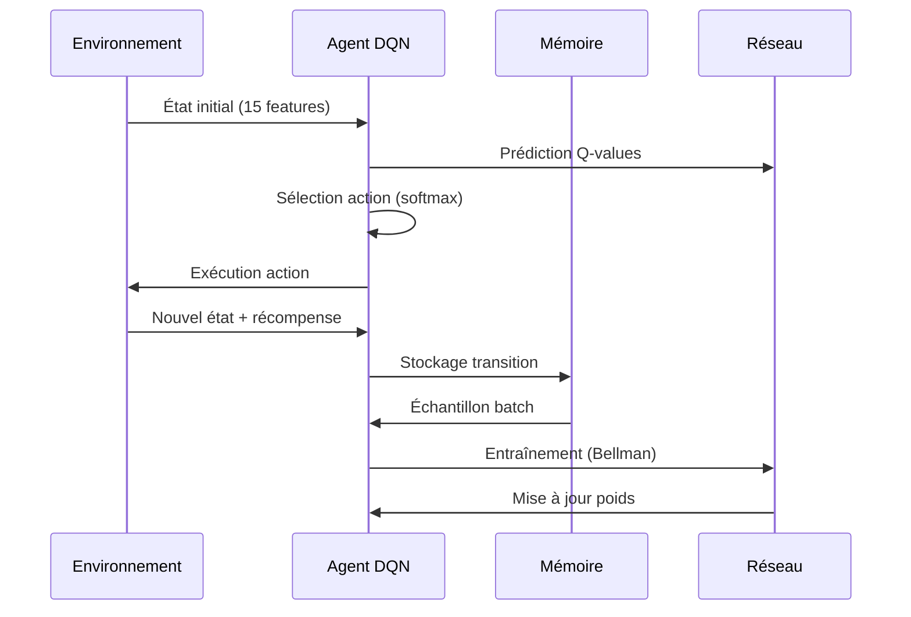
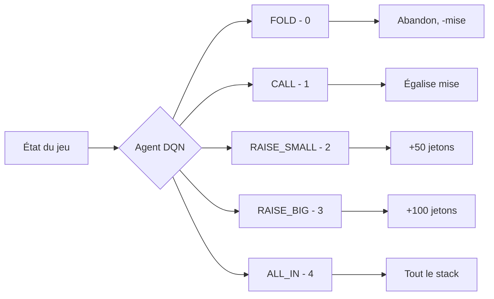
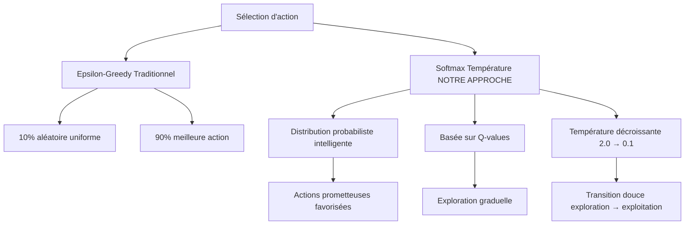
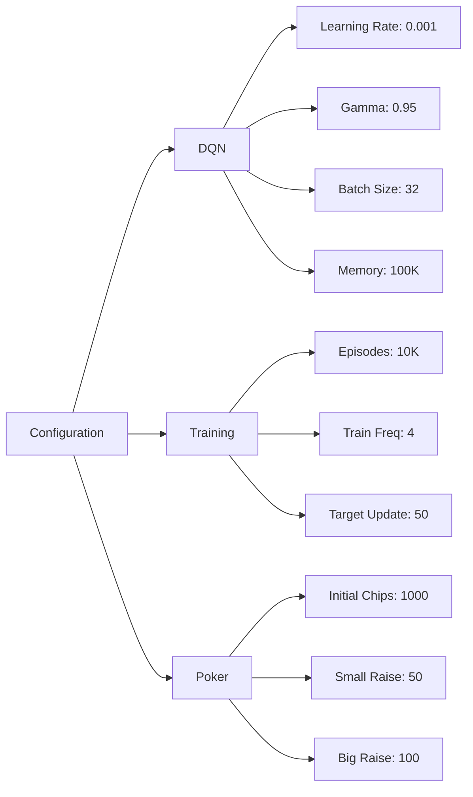
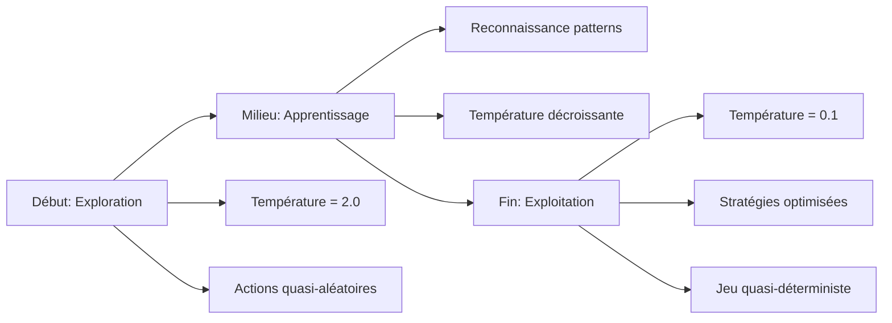

# Projet DQN Texas Hold'em No Limit

## Vue d'ensemble

Le projet implémente un **agent d'intelligence artificielle** utilisant le **Deep Q-Network (DQN)** pour apprendre à jouer au **Texas Hold'em Poker No Limit**. L'agent utilise l'apprentissage par renforcement avec exploration **softmax/température** au lieu de la méthode epsilon-greedy traditionnelle.

## Structure des fichiers

```
DQN_TexasHoldEm_NoLimit/
├── README.MD                    # Documentation principale
├── regles-poker.MD             # Règles du poker Texas Hold'em
├── requirements.txt            # Dépendances Python
└── src/
    ├── main.py                # Point d'entrée principal
    ├── config.py              # Configuration globale
    ├── poker_game.py          # Environnement de jeu (TreysPokerEnv)
    ├── dqn_agent.py          # Agent d'apprentissage par renforcement
    ├── console_display.py     # Interface console stylée
    ├── multi_agent_poker.py   # Jeu multi-agents (futur)
    ├── multi_agent_training.py # Entraînement multi-agents (futur)
    ├── checkpoints/           # Sauvegarde des modèles
    └── logs/                  # Logs TensorBoard
```

## Composants principaux

### 1. **Environnement de jeu** (poker_game.py)
- **TreysPokerEnv** : Simulation complète du poker Texas Hold'em
- **Évaluation des mains** avec la bibliothèque Treys
- **Stratégie d'adversaire** intégrée (bot avec logique prédéfinie)
- **État vectorisé** (15 dimensions) pour l'IA

### 2. **Agent DQN** (dqn_agent.py)
- **Réseau de neurones** dense pour approximer Q(s,a)
- **Experience Replay** avec buffer circulaire (100K transitions)
- **Target Network** pour la stabilité d'entraînement
- **Exploration softmax** avec température décroissante (2.0 → 0.1)

### 3. **Interface console** (console_display.py)
- **Affichage stylé** avec couleurs (colorama)
- **Visualisation des cartes** et de l'état du jeu
- **Statistiques d'entraînement** en temps réel

## Flux d'entraînement



## Actions disponibles



## Innovation : Exploration Softmax

### Comparaison Epsilon-Greedy vs Softmax



### Formule Softmax avec température
$$
P(\text{action}_i) = \frac{\exp\left(\frac{Q(s, \text{action}_i)}{\text{température}}\right)}{\sum_j \exp\left(\frac{Q(s, \text{action}_j)}{\text{température}}\right)}
$$

## Technologies utilisées

- **TensorFlow/Keras** : Réseaux de neurones
- **Treys** : Évaluation des mains de poker
- **NumPy** : Calculs matriciels
- **Colorama** : Interface console colorée
- **TensorBoard** : Monitoring d'entraînement

## Hyperparamètres clés



## Métriques d'entraînement

## Métriques d'entraînement surveillées

L'entraînement de l'agent DQN est suivi par plusieurs métriques clés permettant d'évaluer sa progression :

### Métriques de performance
- **Taux de victoire (%)** : Pourcentage de parties gagnées par l'agent, indicateur principal de l'efficacité de la stratégie apprise
- **Récompense moyenne** : Moyenne des gains/pertes par épisode, reflète la rentabilité globale de l'agent
- **Longueur des parties** : Nombre moyen de tours par partie, indique si l'agent développe des stratégies agressives ou conservatrices

### Métriques techniques du réseau
- **Loss du réseau** : Erreur de prédiction du modèle neural, doit diminuer au cours de l'entraînement pour signaler un apprentissage efficace
- **Q-values moyennes** : Valeurs moyennes des estimations de récompense future, permet de détecter la sur/sous-estimation des actions

### Métriques d'exploration
- **Température actuelle** : Niveau d'exploration softmax (2.0 → 0.1), contrôle la transition exploration/exploitation
- **Taille mémoire** : Nombre de transitions stockées dans le buffer d'experience replay (max 100K), assure la diversité d'apprentissage

Ces métriques sont visualisées en temps réel dans la console et sauvegardées via TensorBoard pour analyse post-entraînement.

## Résultats attendus

L'agent apprend progressivement à :

1. **Évaluer la force** de ses mains selon le contexte
2. **Gérer son stack** efficacement (bankroll management)
3. **Adapter ses mises** selon la situation (pot control)
4. **Développer des stratégies** contre l'adversaire
5. **Équilibrer bluff et value betting**

## Evolution de l'apprentissage



## Extensions possibles

- **Mode multi-agents** (agent vs agent)
- **Adversaires adaptatifs** avec différents styles
- **Support du jeu en ligne** avec APIs
- **Interface graphique** interactive
- **Analyse des stratégies** apprises post-entraînement
- **Transfer learning** vers d'autres variantes de poker

## Avantages de l'approche

1. **Exploration intelligente** : Favorise les actions prometteuses
2. **Stabilité d'apprentissage** : Target network + experience replay
3. **Flexibilité** : Configuration centralisée dans config.py
4. **Monitoring** : TensorBoard + console colorée
5. **Extensibilité** : Architecture modulaire pour multi-agents
