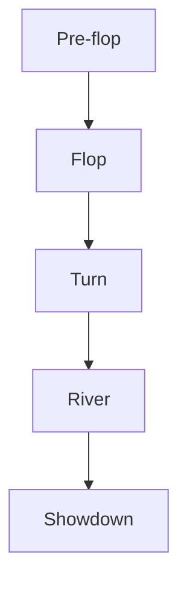

# DQN for Texas Hold'em Poker
## Présentation du Texas Hold'em No Limit

Le Texas Hold'em No Limit est la variante de poker la plus populaire au monde. Ses principales caractéristiques sont :

- **2 cartes privées** par joueur (*hole cards*)
- **5 cartes communes** révélées progressivement (*community cards*)
- **Aucune limite de mise** : chaque joueur peut miser tout son stack à tout moment
- **La meilleure main de 5 cartes** remporte le pot

### Différences avec le Limit Hold'em

| Aspect      | No Limit                                 | Limit                                 |
|-------------|------------------------------------------|---------------------------------------|
| **Mises**   | Toute somme jusqu'au stack complet       | Mises fixes prédéterminées            |
| **Stratégie** | Psychologie, gestion du stack, timing  | Mathématiques, pot odds               |
| **Pression** | Menace constante du tapis               | Pression limitée                      |
| **Complexité** | Très élevée                           | Modérée                               |

## Lexique du Texas Hold'em Poker No Limit

### Actions de jeu

| Action         | Définition                                              | Conséquence/Coût                  | Stratégie                                      | Code                      |
|----------------|--------------------------------------------------------|-----------------------------------|------------------------------------------------|---------------------------|
| **FOLD**       | Abandonner sa main et se retirer du coup               | Perte des jetons misés            | Minimiser les pertes avec mains faibles         | `PokerAction.FOLD = 0`    |
| **CALL**       | Égaliser la mise de l'adversaire                       | Différence de mise                | Voir la suite sans augmenter les enjeux         | `PokerAction.CALL = 1`    |
| **RAISE_SMALL**| Relance de 50 jetons                                   | Call + 50 jetons                  | Mise d'information ou value bet                 | `PokerAction.RAISE_SMALL = 2` |
| **RAISE_BIG**  | Relance de 100 jetons                                  | Call + 100 jetons                 | Mise agressive pour construire le pot           | `PokerAction.RAISE_BIG = 3`   |
| **ALL_IN**     | Miser tous ses jetons restants                         | Totalité du stack                 | Protection ou pression maximale                 | `PokerAction.ALL_IN = 4`  |

---

### Phases du jeu

- **Pre-flop** : Distribution des cartes privées, premier tour d'enchères
- **Flop** : 3 cartes communes, deuxième tour d'enchères
- **Turn** : 4ème carte commune, troisième tour d'enchères
- **River** : 5ème carte commune, dernier tour d'enchères
- **Showdown** : Comparaison des mains, attribution du pot

---

### Positions et blinds

- **Small Blind (SB)** : Mise forcée du joueur à gauche du dealer (moitié du big blind)
- **Big Blind (BB)** : Mise forcée plus importante (mise minimale de référence)

---

### Types de mains (du plus fort au plus faible)

1. **Quinte flush royale** : A♠ K♠ Q♠ J♠ 10♠
2. **Quinte flush** : 5 cartes consécutives de même couleur
3. **Carré** : 4 cartes identiques
4. **Full house** : Brelan + paire
5. **Flush** : 5 cartes de même couleur
6. **Quinte** : 5 cartes consécutives
7. **Brelan** : 3 cartes identiques
8. **Double paire** : 2 paires différentes
9. **Paire** : 2 cartes identiques
10. **Carte haute** : Aucune combinaison

---

### Concepts stratégiques

- **Value bet** : Miser avec une main forte pour extraire de la valeur
- **Bluff** : Miser avec une main faible pour faire folder l'adversaire
- **Pot odds** : Rapport entre la mise à suivre et la taille du pot
- **Stack** : Nombre total de jetons d'un joueur
- **Position** : Ordre de parole dans les tours d'enchères
- **Range** : Éventail de mains possibles pour un joueur

---

### Termes techniques dans le code

- **Hand strength (Force de la main)** : Score numérique calculé par Treys (1 = meilleur, 7462 = pire), normalisé entre 0 et 1 dans l'agent
- **State vector (Vecteur d'état)** : Représentation numérique de la situation pour l'IA (15 dimensions)
- **Betting round (Tour d'enchères)** : 0 = pre-flop, 1 = flop, 2 = turn, 3 = river

Pour avoir une compréhension du code, voir **README.MD**